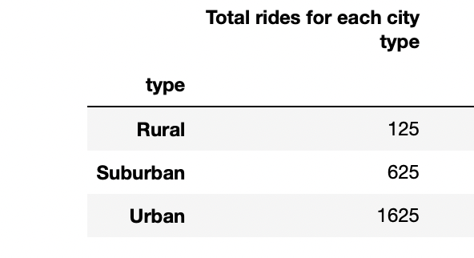

# PyBer_Analysis 
## Analysis 
 The purpose of the assignment was to create a summary of the ridesharing data by city type, and then to create a multi-line graph that shows weekly fares for each city type.  
## Results 
The city type with the most amount of rides would be Urban. This would have been my hypothesis before the data was analyzed. Here is a comparison of the different cities total number of ride shares. 

Included is a table that gives a description of the ride share data. As you can see, the most amount of ride shares were conducted in the 'Urban' cities, while also having the lowest average fare per ride as well as average fare per driver for each city type. 
